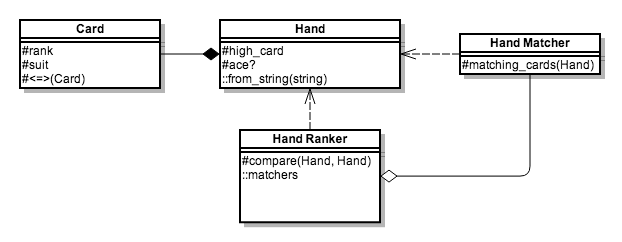

# Project Euler #54: Poker hands

Original problem at https://projecteuler.net/problem=54

## Commentary

Ideally it would seem natural to call `Hand#<=>` to compare two given hands;
however, that would require `Hand` to be aware of the rules of ranking
different poker hands. It would also make it clumsy to substitute different
ranking rules, such as happens with the 54-card deck.

Therefore, I have assigned a separate `HandRanker` class to compare hands. This
could be easily and naturally substituted with a different one based on
whatever ruleset is in play.  `HandRanker` has an ordered list of hand matching
definitions which it applies to the hands being ranked. With this structure,
each `HandMatcher` is also independently testable.
